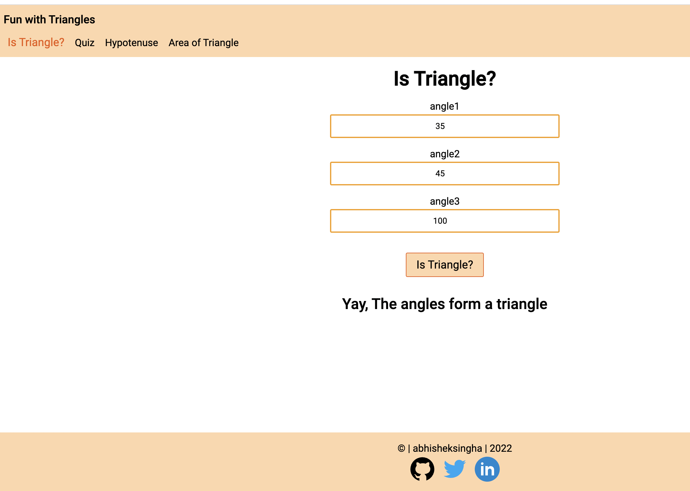
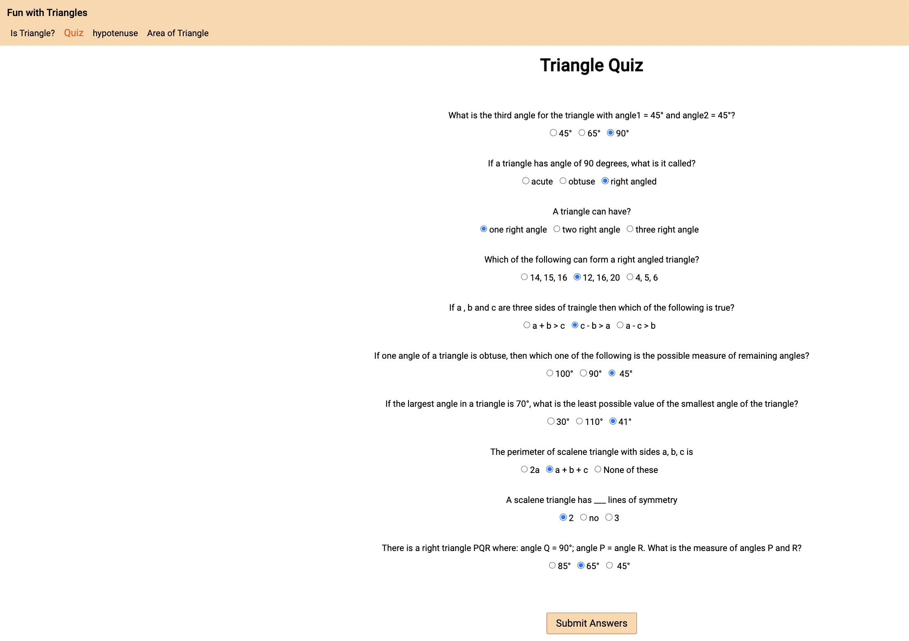
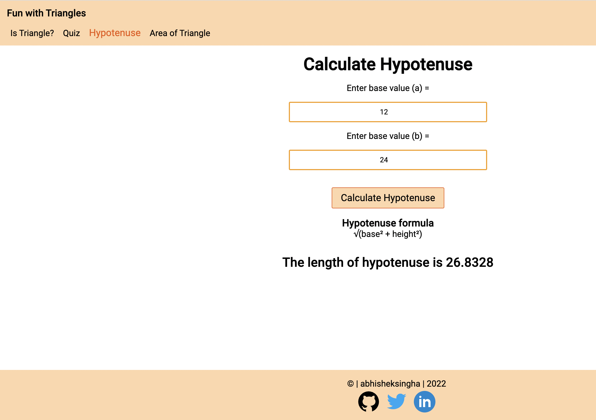
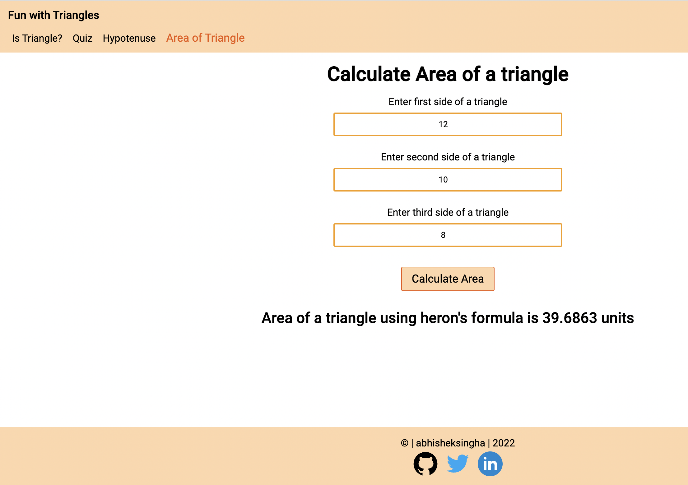

# learn-triangles

A website which helps you to learn about triangles.

## Demo -

You can view this app live here - [Demo](https://)

## Tech Stack -

HTML, JavaScript, CSS for styling

## Documentation -

This app is built using HTML, JavaScript and CSS for styling. It helps user to learn about traingles using quiz and interactions.
 

Features -
- This app has 4 different games.
- Is Triangle (to check if 3 angles make a triangle)
- Quiz (related to triangles and their properties). Quiz also gives score for the correct answers.
- Hypotenuse (calculate the hypotenuse)
- Area of Traingle (calculate area of triangle)

## Screenshots -

Is Triangle -

Quiz - 

Hypotenuse - 

Area of Traingle -

## Author -

- Abhishek Singha - [abk9778singha](https://github.com/abk9778singha)

